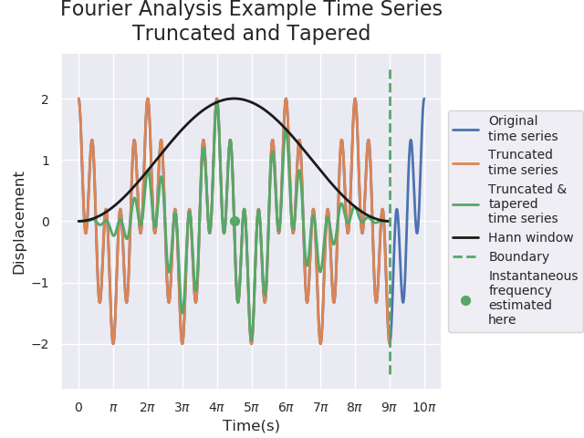
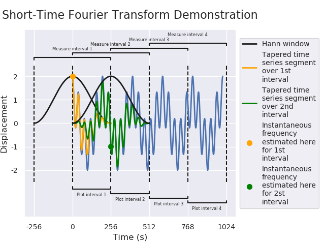
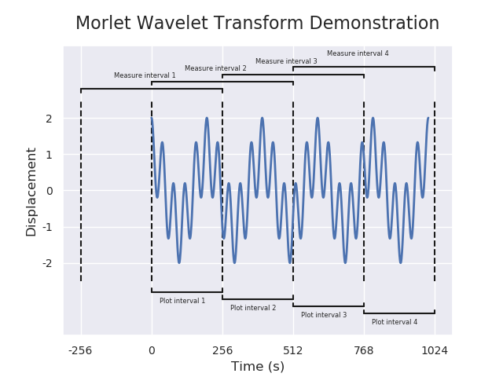
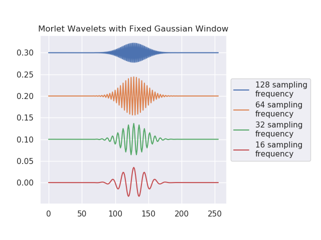
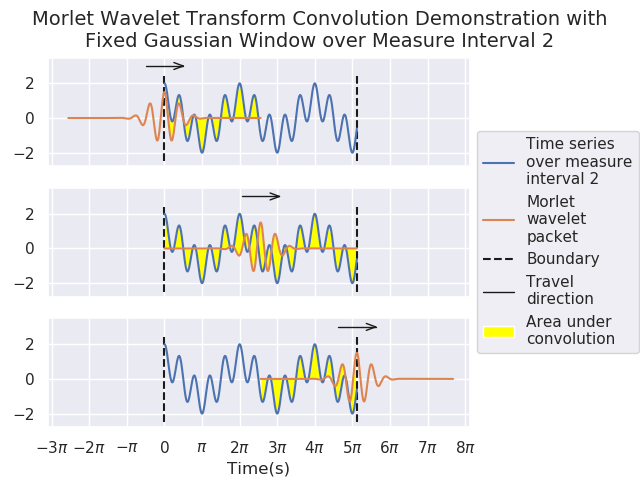
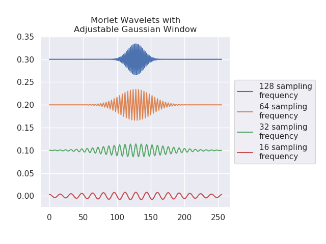
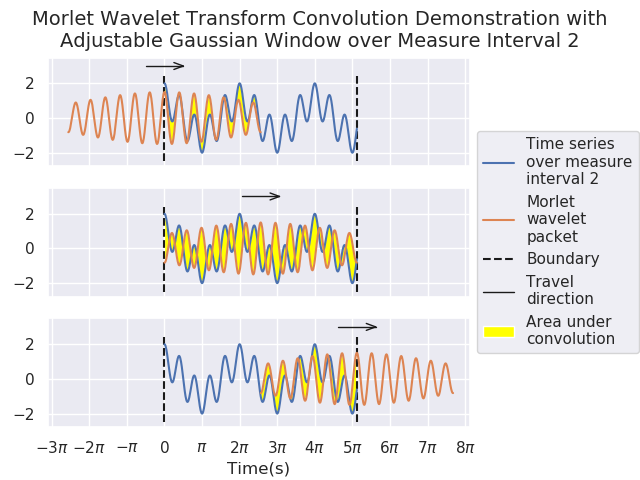

# Setup and Running 
## Dash App
1. Install `docker` and `docker-compose`. Install instructions for Docker can be found [here for Windows 10](https://docs.docker.com/desktop/windows/install/), and [here for MacOS](https://docs.docker.com/desktop/mac/install/). Docker for Desktop includes docker-compose unless you're on Linux. `docker-compose` install instructions for Linux can be [found here](https://docs.docker.com/compose/install/).
2. Run `docker-compose up -d` in `bash`, `PowerShell`, or `cmd` while in the `instantaneous-frequency` directory to run `Dash_app.py`. The Dash App will be located at `http://localhost:8050`. Hot code swapping is enabled, so you can make a change to the code and refresh the page without restarting the container.
3. To view logs run `docker-compose logs` to look at any error output. Use `docker-compose logs -f` to ''follow'', i.e., keep it open. You should do this in another terminal window and keep an eye on it.

## Jupyter Notebook

1. Install `docker` as for Dash App
2. run `docker run -v $(pwd):/home/jovyan/work -p 8888:8888 jupyter/scipy-notebook`. The output will look like the following

```
WARNING: Jupyter Notebook deprecation notice https://github.com/jupyter/docker-stacks#jupyter-notebook-deprecation-notice.
Entered start.sh with args: jupyter notebook
Executing the command: jupyter notebook
[I 15:51:27.315 NotebookApp] Writing notebook server cookie secret to /home/jovyan/.local/share/jupyter/runtime/notebook_cookie_secret
[W 2022-01-12 15:51:27.806 LabApp] 'ip' has moved from NotebookApp to ServerApp. This config will be passed to ServerApp. Be sure to update your config before our next release.
[W 2022-01-12 15:51:27.806 LabApp] 'port' has moved from NotebookApp to ServerApp. This config will be passed to ServerApp. Be sure to update your config before our next release.
[W 2022-01-12 15:51:27.806 LabApp] 'port' has moved from NotebookApp to ServerApp. This config will be passed to ServerApp. Be sure to update your config before our next release.
[W 2022-01-12 15:51:27.806 LabApp] 'port' has moved from NotebookApp to ServerApp. This config will be passed to ServerApp. Be sure to update your config before our next release.
[I 2022-01-12 15:51:27.813 LabApp] JupyterLab extension loaded from /opt/conda/lib/python3.9/site-packages/jupyterlab
[I 2022-01-12 15:51:27.813 LabApp] JupyterLab application directory is /opt/conda/share/jupyter/lab
[I 15:51:27.817 NotebookApp] Serving notebooks from local directory: /home/jovyan
[I 15:51:27.817 NotebookApp] Jupyter Notebook 6.4.6 is running at:
[I 15:51:27.817 NotebookApp] http://30ee6d7779b6:8888/?token=4c247c2a625d2c13662dc49726c2fb8852e08b71ee678b60
[I 15:51:27.817 NotebookApp]  or http://127.0.0.1:8888/?token=4c247c2a625d2c13662dc49726c2fb8852e08b71ee678b60
[I 15:51:27.817 NotebookApp] Use Control-C to stop this server and shut down all kernels (twice to skip confirmation).
[C 15:51:27.820 NotebookApp] 
    
    To access the notebook, open this file in a browser:
        file:///home/jovyan/.local/share/jupyter/runtime/nbserver-7-open.html
    Or copy and paste one of these URLs:
        http://30ee6d7779b6:8888/?token=4c247c2a625d2c13662dc49726c2fb8852e08b71ee678b60
     or http://127.0.0.1:8888/?token=4c247c2a625d2c13662dc49726c2fb8852e08b71ee678b60
```

Copy and paste the URL that looks like the following into your browser: `http://127.0.0.1:8888/?token=<TOKEN>`

# Instantaneous_frequency_demonstration
Demonstrating different interpretations and calculations of instantaneous frequency. The figures include in this package attempt to assist in the understanding of the underlying processes. Some of the figures included are shown below:


### Fourier Analysis





### Short-Time Fourier Transform





### Morlet Wavelet Transform

















